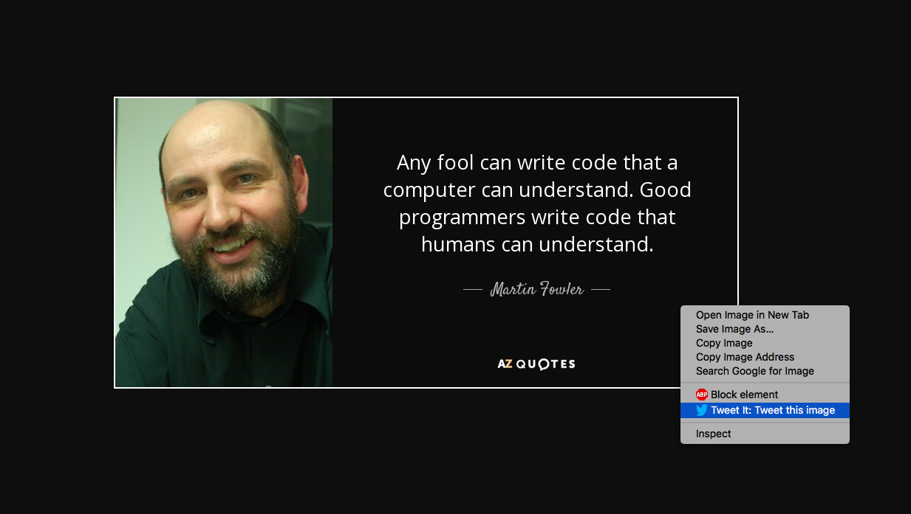
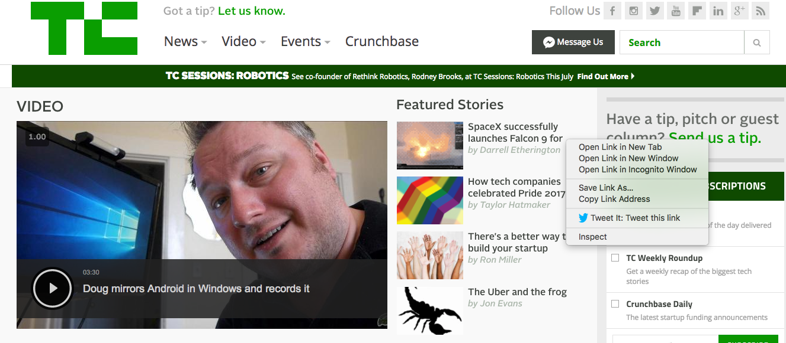
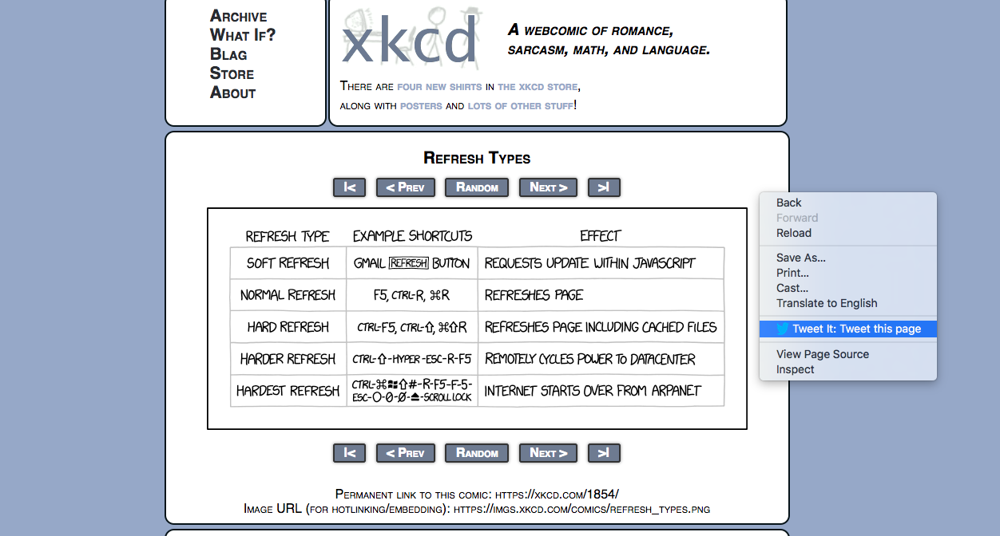
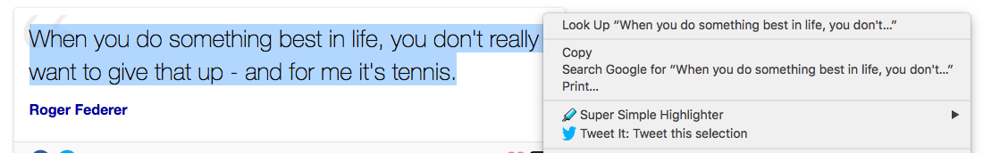

# Tweet-It

* Use this Google Chrome Extension to tweet an image, a link, or a bunch of text found anywhere on the Web.
* Simple to use:
  * Higlight a piece of text and right click to find the extension.
  * Right click on an image or a link to find the extension.

## Chrome Store Link:
https://chrome.google.com/webstore/detail/tweet-it/nahnpfgjhimdgbebbgnpgdmpffpjccip

### Tweet an image

### Tweet a link

### Tweet a page

### Tweet highlighted text

